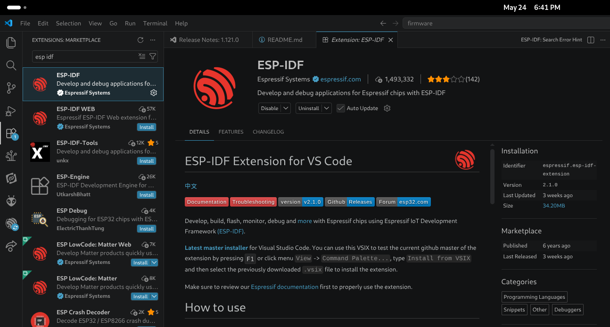
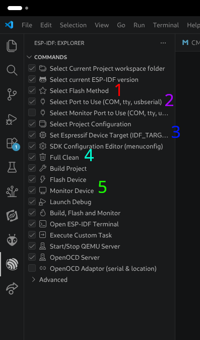
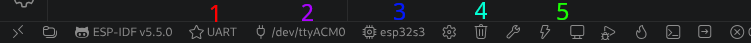

# ESP32 Firmware

We use **ESP-IDF** and **FreeRTOS** to implement the firmware on our esps.

The documentation is really good and can be found here:
- **ESP-IDF**: https://docs.espressif.com/projects/esp-idf/en/stable/esp32/index.html
- **FreeRTOS**: https://www.freertos.org/Documentation/00-Overview

## Setup

### Step 1: Install ESP-IDF Required Software

- Windows (Online Installation Recommended): https://docs.espressif.com/projects/esp-idf/en/stable/esp32/get-started/windows-setup.html#step-3-install-esp-idf-using-eim
- Mac (Online Installation Recommended): https://docs.espressif.com/projects/esp-idf/en/stable/esp32/get-started/windows-setup.html#step-3-install-esp-idf-using-eim
- Linux: https://docs.espressif.com/projects/esp-idf/en/stable/esp32/get-started/linux-setup.html

Keep track of the installation path for step 2.

### Step 2: Install the ESP-IDF VSCode Extension

## File Structure

This covers the directories within firmware/esp_idf.

### Components

Template: [components/template](components/template) 

Stores component libraries only. Each IC or network structure will have one of these. This is not for helper functions for any specific prod file.

Examples of components is a specific adc library, or a udp client library.

### Production

Template: [prod/template](prod/template)

This is for the production files for any given full board firmware. Note there is space in the template for specific production projects' components.

### Tests

Template [test/template](test/template)

This is for tests for specific component libraries. You can either use the test file and write a test class for in depth testing, or you can write tests directly into the main file.

## Running a Project

First thing is to plug into the ESP device to your computer.

It's easiest to run a project by opening it up in an isolated VSCode window. So open a project (either in esp_idf/prod/project_name or esp_idf/test/test_name) as the parent directy in VSCode.

There are two spots to access the ESP-IDF functions that you need to run a project. The extension side pannel (looks like a ball with lines) and the menu bar at the *bottom* of the VSCode window.

**Sidebar menu:**

**Bottom menu bar:**

### Operations

1. **Flash Method**: This should be UART
2. **Flash and Monitor Port**: Should be the same, if you click this then it will open a list of ports and look for the one that has been assigned to the ESP device plugged in. 
3. **Set Espressif Device Target**: This should be the type of ESP32 that you're trying to flash (usually esp32c6 or esp32s3). It should say it on the ESP.
4. **Full Clean**: This is helpful if you run into any weird errors in flashing or building. It will delete the build directory that is automatically generated. You can also delete this directory manually.
5. **Run Commands**:
    - **Build**: builds project - only full builds if the build directory is cleaned.
    - **Flash**: flashes the build to the ESP.
    - **Monitor**: opens up the serial monitor in your terminal based on the port given in the setup. Sometimes you will have to manually type the port in.
    - **Build, Flash, and Monitor**: Runs all the three above commands back to back. This is usually what I use.