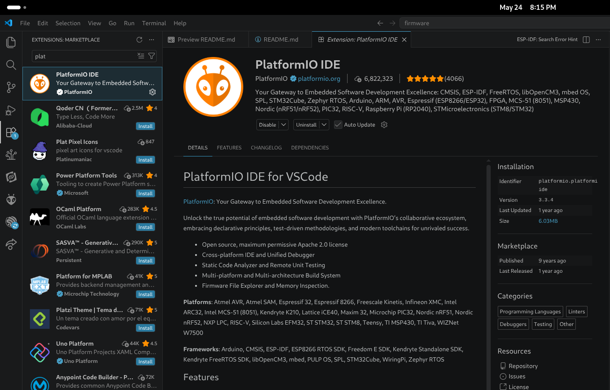
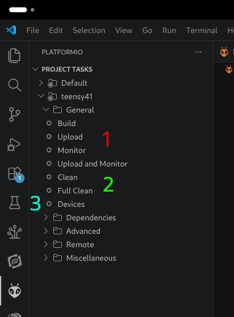
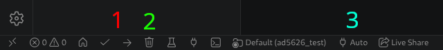

# Teensy Firmware

We use Platform IO to flash our teensys. And we use the Arduino ecosystem for all the firmware.

Teensyduino docs: https://www.pjrc.com/teensy/tutorial.html

This is basically all Arduino code so if you need more documentation just look at Arduino guides and forums.

## Platform IO Setup

We will setup VSCode Platform IO to flash and monitor our teensy.

### Step 1: Install VSCode Platform IO Extension

Search for it in the VSCode extensions tab and install it.

That's it, it's pretty easy.

## File Structure

### Components

Template: [components/template](components/template) 

Stores component libraries only. Each IC or network structure will have one of these. This is not for helper functions for any specific prod file.

### Production

Template: [prod/template](prod/template)

This is for the production files for any given full board firmware. Note there is space in the template for specific production projects' components.

### Tests

Template [test/template](test/template)

This is for tests for specific component libraries. You can create files to help you test, or you can write tests directly into the main file.

## Running a Project

First thing is to plug into the teensy into your computer.

It's easiest to run a project by opening it up in an isolated VSCode window. So open a project (either in teensy/prod/project_name or teensy/test/test_name) as the parent directy in VSCode.

There are two spots to access the Plat IO functions that you need to run a project. The extension side pannel (looks like an alien) and the menu bar at the *bottom* of the VSCode window.

**Sidebar Menu:**

**Bottom Bar Menu:**

### Operations

1. **Run Commands**:
    - **Build**: builds project - only full builds if the build directory is cleaned.
    - **Upload**: flashes the build to the teensy. Will also automatically run the build if changes were made.
    - **Monitor**: opens up the serial monitor in your terminal based on the port that is usually auto selected.
    - **Upload and Monitor**: Runs the commands above back to back. This is what I use usually.
2. **Clean**: I usually use the **Full Clean** option, it deletes the build directory and build configuration if full cleaned. Helpful for weird errors.
3. **Devices/Port**: The devices button will list all connected devices and which port it is on - this is good for flashing issues. The bar menu 3 shows where you can specify the port - leaving it on auto is fine.

### Common Issue

Sometimes there is issues monitoring the teensy, the solution to this is to try opening the port in terminal or by using the Arduino IDE. Note if you do this to make sure to close that window whenever you want to flash again.